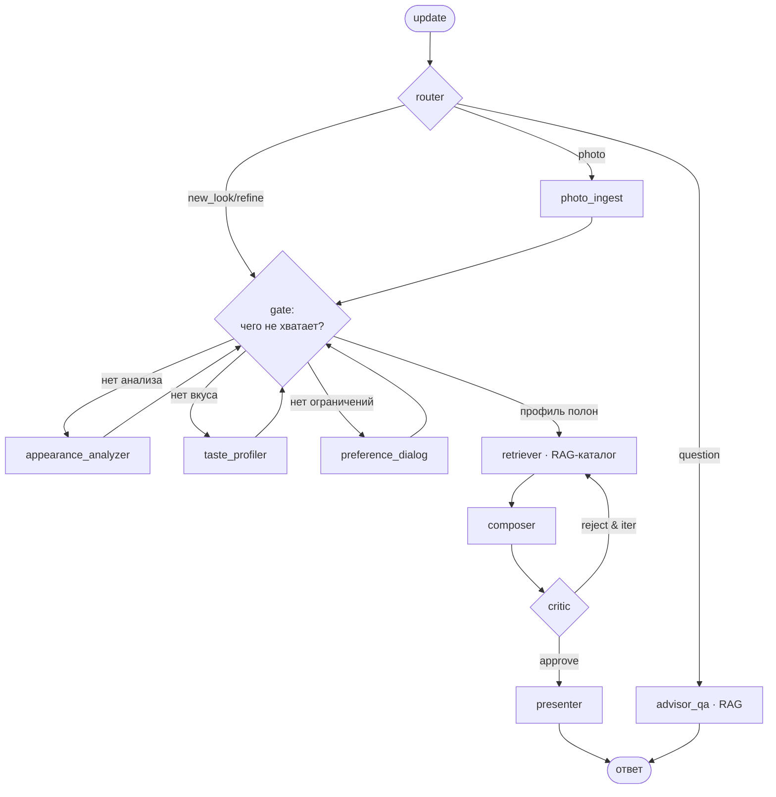

# 👗 Stylist Bot — Telegram-бот-стилист на мультиагентном графе

AI-агент, который собирает готовые образы под конкретного человека по **фото фигуры/лица**
и **вкусу, выявленному из фото-референсов**, и подбирает одежду, **реально доступную в
московских магазинах** (с проверкой наличия, размера и цены).

Дипломный проект №1 (курс по AI-агентам). Полное архитектурное обоснование — в
[docs/adr/ADR-001-architecture.md](docs/adr/ADR-001-architecture.md).

---

## Какую задачу решает агент

Пользователь присылает фото фигуры/лица + 3–7 фото нравящихся образов + повод и бюджет →
бот выдаёт 1–3 образа из вещей, которые можно купить в Москве, с обоснованием и ссылками.

## Архитектура (схема графа)



**Три точки ветвления:** `router` (интент), `gate` (полнота профиля), `critic` (петля самокоррекции).

### Почему агент, а не pipeline
Скелет пути детерминирован (надёжно, дёшево, тестируемо), но три места принимают решение
по контексту — это и делает граф нелинейным агентом. Свободный ReAct избыточен: он
недетерминирован, плохо ложится на бенчмарк и жжёт токены дорогой vision-модели.

### Почему нужен RAG
«Реально доступно в Москве» невозможно без retrieval по **живому каталогу товаров** (модель
не знает актуальный ассортимент и цены). Второй RAG — по **базе правил стиля** — обосновывает
советы и критику. Каталог — **гибрид**: снимок как основа + live-API по флагу `CATALOG_MODE`.

## Инструменты (≥3, ≥1 внешний)

| Tool | Внешний? | Назначение |
|------|----------|-----------|
| `search_catalog` | **API маркетплейса** | поиск товаров с доставкой по Москве |
| `check_availability` | **API маркетплейса** | наличие/размер/цена на момент выдачи |
| `retrieve_styling_rules` | RAG | правила колористики/фигуры/капсул |
| `analyze_appearance` / `profile_taste` | облачный vision | атрибуты из фото |
| `save_look_collage` | файловая система | карточка/коллаж образа |

## Запуск

```bash
python -m venv .venv && source .venv/bin/activate
pip install -r requirements.txt

# демонстрация графа (без ключей, STUB-режим)
PYTHONPATH=src python demo_cli.py

# бенчмарк: success_rate / latency p95
PYTHONPATH=src python evals/run_bench.py

# backend-API (FastAPI) — «мозг» агента за HTTP
PYTHONPATH=src uvicorn stylist.api.app:app --port 8000
#   curl -s localhost:8000/health
#   curl -s -X POST localhost:8000/message -H 'Content-Type: application/json' -d '{"text":"Собери образ в офис"}'

# Telegram — тонкий клиент API (нужны TELEGRAM_TOKEN и запущенный API)
PYTHONPATH=src python -m stylist.bot.telegram_app

# инкрементальное обновление каталога (по расписанию)
PYTHONPATH=src python scripts/sync_catalog.py

# демо персонализации (контекстный бандит на фидбэке)
PYTHONPATH=src python scripts/demo_personalization.py

# трассируемый прогон в LangFuse (проверка observability)
PYTHONPATH=src python scripts/trace_smoke.py
```

## Configuration reference (.env)

Шаблон — [.env.example](.env.example). Все переменные читаются в [src/stylist/config.py](src/stylist/config.py) (`.env` подхватывается автоматически через dotenv).

| Переменная | Назначение | Дефолт |
|---|---|---|
| `STUB_LLM` | `true` = LLM/vision на детерминированных заглушках (без ключей и оплаты) | `true` |
| `CATALOG_MODE` | `snapshot` (файл-снимок) или `live` (API маркетплейса) | `snapshot` |
| `SNAPSHOT_PATH` | путь к снимку каталога | `data/catalog_snapshot.sample.json` |
| `MAX_ITERATIONS` | лимит петли самокоррекции critic→retriever | `2` |
| `MAX_GATE_TRIES` | сколько раз gate дёргает один сборщик профиля (защита от зацикливания) | `1` |
| `PERSONALIZATION` | `true` = реранк выдачи контекстным бандитом по фидбэку | `false` |
| `OPENAI_API_KEY` | ключ OpenAI (боевой vision/LLM; читается SDK напрямую) | — |
| `VISION_API_KEY` | ключ vision-модели (если пуст — берётся `OPENAI_API_KEY`) | — |
| `VISION_MODEL` | мультимодальная модель для анализа фото | `gpt-4o-mini` |
| `LLM_API_KEY` / `LLM_MODEL` | text-LLM (судья, оркестрация) | — |
| `TELEGRAM_TOKEN` | токен бота от @BotFather | — |
| `LANGFUSE_PUBLIC_KEY` / `LANGFUSE_SECRET_KEY` | ключи проекта LangFuse (пусто = трейсинг выключен) | — |
| `LANGFUSE_HOST` | хост LangFuse | `https://cloud.langfuse.com` |
| `DATABASE_URL` | БД состояния: локально SQLite, в проде Postgres | `sqlite:///data/stylist.db` |
| `API_URL` | адрес backend-API для клиентов (бот) | `http://localhost:8000` |
| `API_TOKEN` | секрет заголовка `X-API-Token` (пусто = без проверки) | — |
| `UPLOAD_DIR` | куда складывать фото пользователей | `data/uploads` |
| `DEFAULT_USER_ID` | пользователь в режиме «без входа» | `me` |

## Серверная форма — Фаза 1 (см. [ADR-003](docs/adr/ADR-003-backend-service-and-deploy.md))

Агент вынесен в **backend-сервис**: `stylist.api.app` (FastAPI) держит граф, а Telegram и
будущий веб-UI — тонкие клиенты одного API (`/message`, `/photo`, `/feedback`, `/new_arrivals`).
Состояние (каталог, фидбэк, профиль пользователя) — в **общей БД** через SQLAlchemy: локально
SQLite (`data/stylist.db`, автосидинг из снимка), в проде **Postgres** (`DATABASE_URL`).
Режим «без входа»: один пользователь, публичный доступ защищается `API_TOKEN`.

```bash
# запуск всей связки в контейнерах (Postgres + API [+ бот/синк по профилям])
docker compose up --build              # API на :8000, Postgres рядом
docker compose --profile telegram up   # добавить Telegram-бота
docker compose --profile sync run --rm sync  # разовая синхронизация каталога
```

## Свежесть каталога и персонализация (см. [ADR-002](docs/adr/ADR-002-catalog-sync-and-rl.md))

**Дельта-синхронизация.** `scripts/sync_catalog.py` тянет фиды магазинов через адаптеры
([src/stylist/rag/adapters.py](src/stylist/rag/adapters.py)), сравнивает по контент-хешу и
делает upsert ([src/stylist/rag/sync.py](src/stylist/rag/sync.py)): **добавляет новинки**
(поле `first_seen`), **обновляет** изменившиеся цены/наличие, остальное не трогает.
Идемпотентно. Запуск по cron/launchd/APScheduler. `new_arrivals()` — для проактивных
уведомлений о новинках «в вашем стиле».

**RL, где он уместен.** Контекстный бандит
([src/stylist/personalization/bandit.py](src/stylist/personalization/bandit.py)) учится на
реакциях 👍/👎/«куплю» и реранжирует выдачу в `retriever` (флаг `PERSONALIZATION`).
Reflexion-петля: `critic` пишет текстовые «уроки», `composer` учитывает их на повторной
сборке. Полный multi-agent RL сознательно не используется — обоснование в ADR-002.

## Качество: benchmark и eval

- **Benchmark:** [evals/benchmark.jsonl](evals/benchmark.jsonl) — 12 кейсов `input → expected`.
- **Три типа проверок:**
  1. программный ассерт — [evals/assertions.py](evals/assertions.py) (бюджет/размер/наличие/слоты);
  2. LLM-as-judge — [evals/judge.py](evals/judge.py) (гармония/уместность ≥ 4);
  3. корректность tool-call — [evals/tool_calls.py](evals/tool_calls.py) (composer только из найденных ID; поиск с фильтром «Москва»; наличие проверено до выдачи).

## Метрики

| Метрика | Значение |
|---------|----------|
| success_rate | заполняется из `run_bench.py` |
| latency p95 | заполняется из `run_bench.py` |
| cost per run | $0.00 в STUB; заполняется после подключения LLM/vision |

> В STUB-режиме метрики отражают детерминированную логику поиска/сборки. Реальные значения —
> после подключения облачного vision и text-LLM.

## Observability — LangFuse

Трейс на каждый запуск (узлы, tool-вызовы, токены, длительность). **Фото не логируются** —
только хеш и извлечённые атрибуты ([src/stylist/obs/langfuse_cb.py](src/stylist/obs/langfuse_cb.py)).

## Security-checklist

| Пункт | Статус |
|-------|--------|
| Согласие на обработку фото (биометрия) | ⛳ открыто |
| Retention/удаление фото (`/delete_me`, TTL) | ⛳ открыто |
| Фото не попадают в трейсы/логи | ✅ |
| Шифрование фото at-rest | ⛳ открыто |
| Prompt-injection (текст/изображение) | ⚠️ частично (см. кейс c11) |
| Allowlist доменов в ссылках выдачи | ✅ (ссылки из `Item.url`, не из генерации) |
| Rate limiting на пользователя | ⛳ открыто |
| Управление секретами (`.env`) | ✅ |
| Cost guard + кэш vision по хешу фото | ⚠️ частично |
| Отказ для несовершеннолетних / NSFW | ⛳ открыто |

Легенда: ✅ реализовано · ⚠️ частично · ⛳ открыто.

## Структура

```
src/stylist/
  api/     app.py                                    # FastAPI backend (мозг за HTTP)
  graph/   state.py · nodes.py · edges.py · build.py # LangGraph
  db/      session.py · models.py · repo.py          # SQLAlchemy: SQLite/Postgres
  tools/   catalog.py · vision.py · styling_rules.py · collage.py
  rag/     adapters.py · sync.py                      # адаптеры магазинов + дельта-sync
  personalization/  bandit.py · feedback.py          # контекстный бандит (RL)
  obs/     langfuse_cb.py
  bot/     telegram_app.py                            # тонкий HTTP-клиент API
evals/     benchmark.jsonl · assertions.py · judge.py · tool_calls.py · run_bench.py
scripts/   sync_catalog.py · demo_personalization.py
data/      catalog_snapshot.sample.json · feeds/
Dockerfile · docker-compose.yml
docs/adr/  ADR-001-architecture.md · ADR-002-catalog-sync-and-rl.md · ADR-003-backend-service-and-deploy.md
```
